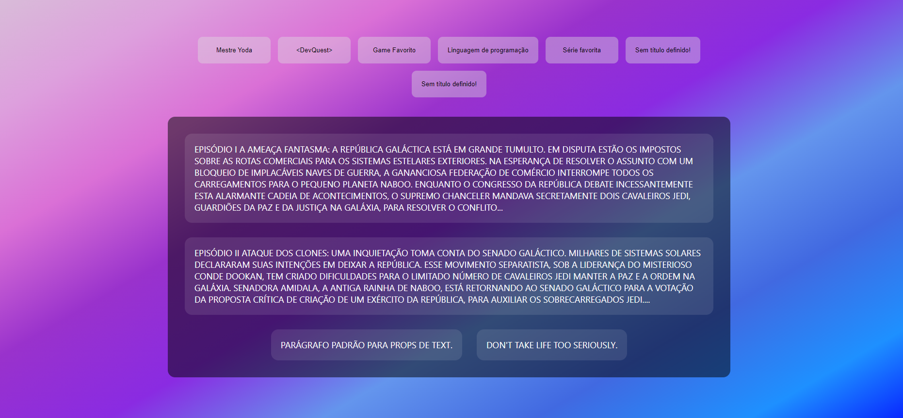
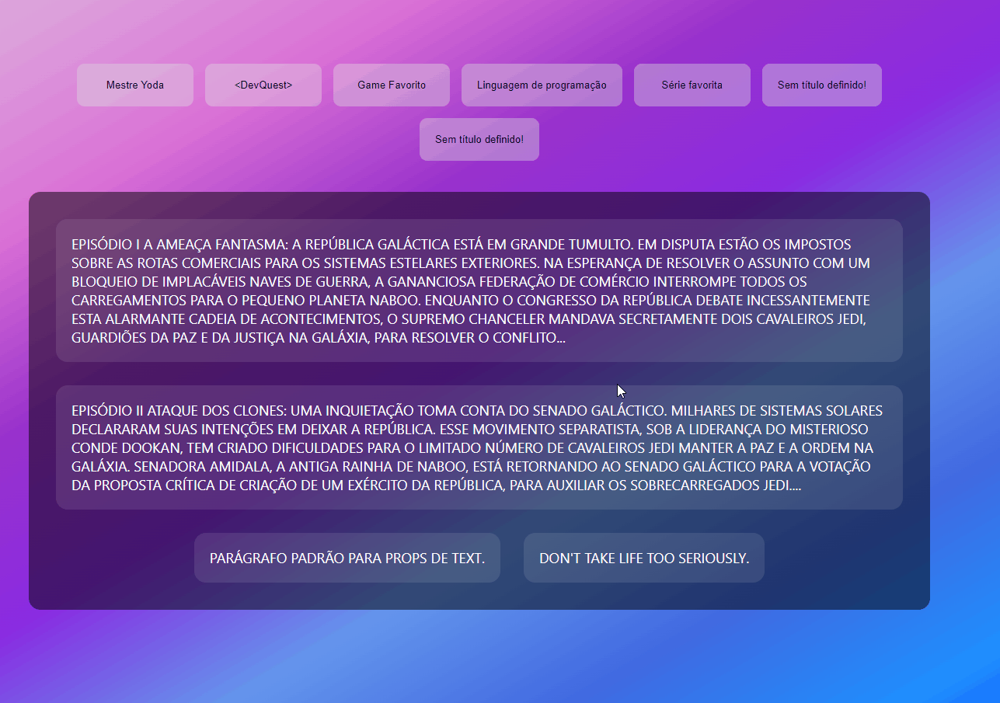
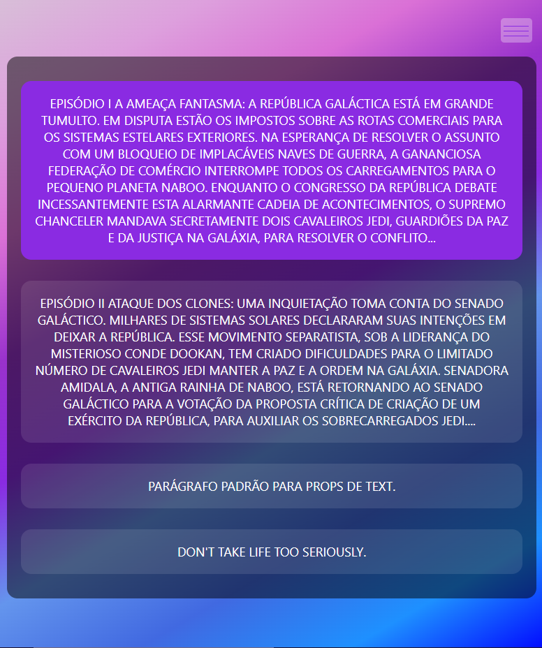
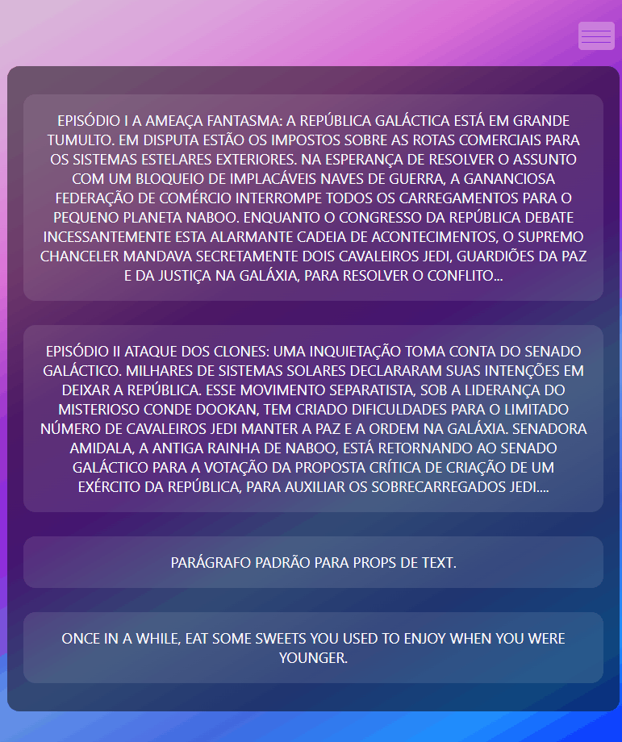

<h1>Projeto Usando React!</h1>

<h2>Esse projeto simples, foi criado com o objetivo de praticar minhas habilidades em React. Projeto proposto pelo curso DevQuest.</h2>

<h3>Tecnologias Utilizadas:</h3>

<link src="https://cdn.jsdelivr.net/gh/devicons/devicon/icons/css3/css3-original-wordmark.svg" alt="CSS3 Logo" width="40px"/>

Advice Slip JSON API

<h3>O projeto tem como objetivo gerar e renderizar elementos na tela, utilizando como principal tecnologia a biblioteca React, criando componentes de maneira com que o código fique organizado e de fácil manutenção. Aqui eu resolvi colocar também a opção de poder usar um parágrafo aleatório que é recebido pela Advice Slip JSON API. O projeto encontra-se totalmente responsivo.</h3>

<ul>
    <li><h3>Screenshots:</h3></li>
    <li><h4>Desktop:</h4></li>
    <li></li>
    <li></li>
    <li><h4>Mobile:</h4></li>
    <li></li>
    <li></li>
</ul>

Espero que gostem 😊.